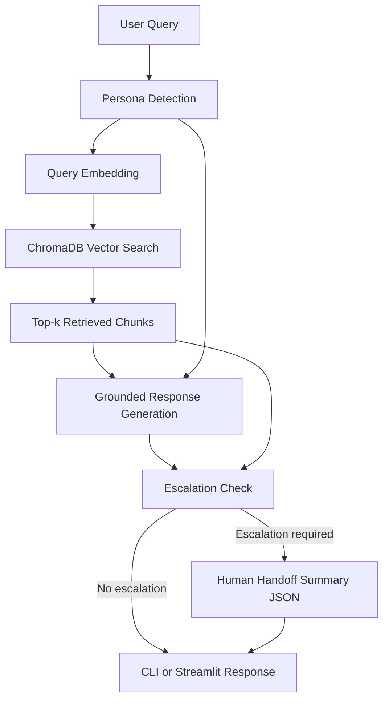

# Persona-Adaptive Customer Support Agent

A production-style AI support agent built for the Adsparkx AI Engineering Intern assignment. The agent detects the customer's persona, retrieves relevant knowledge base content with RAG, generates a grounded response in the right tone, and escalates to a human support representative when the issue should not be handled automatically.

The demo domain is **CloudOps Desk**, a realistic SaaS support product with documents for authentication, SSO, billing, webhooks, data export, incident response, dashboard performance, mobile login, onboarding, SLA, SCIM, and account security.

---

## Features

- Persona detection for:
  - Technical Expert
  - Frustrated User
  - Business Executive
- RAG pipeline over 12 knowledge base documents.
- PDF ingestion included through `account_security_policy.pdf`.
- ChromaDB persistent vector store.
- Local deterministic embeddings for easy reviewer testing without an API key.
- Optional OpenAI embeddings and OpenAI chat model support.
- Persona-aware response generation.
- Configurable escalation rules through `config/escalation_rules.yml`.
- Human handoff summary in structured JSON.
- Interactive CLI.
- Bonus Streamlit UI.
- Unit tests for persona detection, escalation, and chunking.

---

## Tech Stack

| Layer | Tool | Version |
|---|---:|---:|
| Language | Python | 3.11+ |
| Vector Database | ChromaDB | 0.5.23 |
| Embeddings | OpenAI `text-embedding-3-small` or local hashing fallback | configurable |
| LLM | OpenAI chat model or local grounded template generator | configurable |
| PDF Loader | pypdf | 5.1.0 |
| DOCX Loader | python-docx | 1.1.2 |
| CLI | Rich | 13.9.4 |
| UI | Streamlit | 1.41.1 |
| Config | python-dotenv + PyYAML | 1.0.1 / 6.0.2 |
| Tests | pytest | 8.3.4 |

---

## Architecture Diagram



---

## Project Structure

```text
adsparkx-persona-support-agent/
├── config/
│   └── escalation_rules.yml
├── data/
│   └── knowledge_base/
│       ├── account_security_policy.pdf
│       ├── api_authentication_troubleshooting.md
│       ├── billing_invoice_policy.md
│       ├── dashboard_performance_troubleshooting.md
│       ├── data_export_compliance.md
│       ├── mobile_app_login_issue.md
│       ├── onboarding_faq.txt
│       ├── outage_incident_response.md
│       ├── password_reset_guide.md
│       ├── scim_user_provisioning.md
│       ├── sla_policy.md
│       ├── sso_saml_setup_guide.md
│       └── webhook_delivery_troubleshooting.md
├── scripts/
│   ├── demo_queries.txt
│   └── recording_checklist.md
├── src/
│   └── support_agent/
│       ├── chunking.py
│       ├── cli.py
│       ├── config.py
│       ├── document_loader.py
│       ├── embeddings.py
│       ├── escalation.py
│       ├── handoff.py
│       ├── ingest.py
│       ├── persona.py
│       ├── response_generator.py
│       ├── retriever.py
│       ├── schemas.py
│       ├── streamlit_app.py
│       ├── vector_store.py
│       └── workflow.py
├── tests/
├── .env.example
├── pyproject.toml
├── requirements.txt
└── README.md
```

---

## Persona Detection Strategy

The project uses an explainable rule-based classifier in `src/support_agent/persona.py`. This was chosen intentionally because support systems need traceability: the UI can show why a persona was selected.

### Classification signals

**Technical Expert** is detected when the message contains API, logs, OAuth, token, endpoint, status code, SSO, SAML, SCIM, webhook, payload, or configuration language.

**Frustrated User** is detected when the message contains emotional or urgency cues like “nothing works,” “tried everything,” “urgent,” “still not,” “broken,” or emphatic punctuation.

**Business Executive** is detected when the message focuses on operational outcomes such as impact, ETA, SLA, downtime, risk, revenue, operations, or executive summary.

The detector returns:

```json
{
  "persona": "Technical Expert",
  "confidence": 0.82,
  "reasons": ["Matched technical support language: api, oauth, logs"]
}
```

This can be replaced later with an LLM classifier while keeping the same `PersonaDecision` contract.

---

## RAG Pipeline Design

### 1. Document loading

`DocumentLoader` supports:

- Markdown
- TXT
- PDF
- DOCX

PDF pages are loaded with page metadata. Markdown files are split by heading sections before chunking.

### 2. Chunking strategy

`TextChunker` uses approximately 900-character chunks with 120-character overlap. Each chunk keeps metadata:

```json
{
  "source": "api_authentication_troubleshooting.md",
  "section": "Required checks",
  "page": 0
}
```

### 3. Embedding model

Two modes are supported:

- `AGENT_EMBEDDING_PROVIDER=local`: deterministic local hashing embeddings. This keeps the project runnable without any API key.
- `AGENT_EMBEDDING_PROVIDER=openai`: OpenAI embedding model from `OPENAI_EMBEDDING_MODEL`.

### 4. Vector database

ChromaDB is used as the persistent vector database. The default storage path is:

```text
storage/chroma
```

### 5. Retrieval strategy

The retriever embeds the user query, searches ChromaDB, and returns top-k chunks with scores. The CLI displays source document, section/page, and retrieval score.

---

## Adaptive Response Generation

The response generator changes tone based on the detected persona.

### Technical Expert

- Detailed technical explanation
- Root-cause focus
- Step-by-step troubleshooting
- Logs and validation details

### Frustrated User

- Empathetic and calm
- Simple language
- Clear next actions
- Reassurance that escalation can happen without repeating everything

### Business Executive

- Concise summary
- Business impact and risk framing
- Minimal technical jargon
- Resolution guidance and escalation guidance

The OpenAI prompt explicitly instructs the model to answer only from retrieved context. If OpenAI is not configured, the project uses a local grounded response generator that extracts relevant sentences from retrieved chunks and adapts the response style.

---

## Escalation Logic

Escalation is handled by `EscalationEngine` and configured in `config/escalation_rules.yml`.

### Escalation triggers

The agent escalates when:

1. No relevant knowledge base content is found.
2. Top retrieval score is below `min_retrieval_score`.
3. The user remains dissatisfied across multiple turns.
4. Sensitive topics appear, including billing, refund, invoice dispute, legal, contract, account owner, data deletion, security breach, unauthorized charge, compliance, PII, GDPR, or HIPAA.
5. The issue requires identity verification or cannot be safely resolved from documentation.

Example configuration:

```yaml
min_retrieval_score: 0.35
escalate_after_dissatisfied_turns: 2
sensitive_keywords:
  - billing
  - refund
  - invoice dispute
  - legal
  - contract
  - account owner
  - data deletion
  - security breach
```

---

## Human Handoff Summary

When escalation happens, the agent generates structured JSON:

```json
{
  "persona": "Frustrated User",
  "issue": "I've tried resetting my password three times and nothing works!",
  "conversation_history": [
    {"role": "user", "content": "I've tried resetting my password three times..."}
  ],
  "documents_used": [
    "password_reset_guide.md",
    "account_security_policy.pdf"
  ],
  "attempted_steps": [
    "Password reset",
    "Browser cache clear"
  ],
  "recommendation": "Continue with human-assisted troubleshooting and preserve retrieved sources for context.",
  "escalation_reasons": [
    "User appears dissatisfied across 2 recent turn(s), meeting escalation policy."
  ]
}
```

---

## Setup Instructions

### 1. Clone the repository

```bash
git clone <your-repo-url>
cd adsparkx-persona-support-agent
```

### 2. Create a virtual environment

macOS/Linux:

```bash
python3.11 -m venv .venv
source .venv/bin/activate
```

Windows PowerShell:

```powershell
py -3.11 -m venv .venv
.\.venv\Scripts\Activate.ps1
```

### 3. Install dependencies

```bash
pip install --upgrade pip
pip install -r requirements.txt
pip install -e .
```

### 4. Create environment file

```bash
cp .env.example .env
```

Windows PowerShell:

```powershell
Copy-Item .env.example .env
```

### 5. Run in local no-key mode

The project works without an API key in local mode.

```bash
python -m support_agent.ingest
python -m support_agent.cli
```

### 6. Optional OpenAI mode

Add your API key in `.env`:

```env
OPENAI_API_KEY=your_key_here
AGENT_LLM_PROVIDER=openai
AGENT_EMBEDDING_PROVIDER=openai
OPENAI_MODEL=gpt-4o-mini
OPENAI_EMBEDDING_MODEL=text-embedding-3-small
```

Then re-ingest the documents because embeddings changed:

```bash
python -m support_agent.ingest
python -m support_agent.cli
```

---

## Environment Variables

| Variable | Required | Default | Description |
|---|---:|---|---|
| `OPENAI_API_KEY` | No | empty | Required only for OpenAI LLM or OpenAI embeddings |
| `AGENT_LLM_PROVIDER` | No | `local` | `local` or `openai` |
| `AGENT_EMBEDDING_PROVIDER` | No | `local` | `local` or `openai` |
| `OPENAI_MODEL` | No | `gpt-4o-mini` | Chat model used when OpenAI mode is enabled |
| `OPENAI_EMBEDDING_MODEL` | No | `text-embedding-3-small` | Embedding model used in OpenAI mode |
| `TOP_K` | No | `4` | Number of retrieved chunks |
| `MIN_RETRIEVAL_SCORE` | No | `0.35` | Low-confidence escalation threshold |
| `ESCALATE_AFTER_DISSATISFIED_TURNS` | No | `2` | Multi-turn dissatisfaction threshold |
| `VECTOR_DB_PATH` | No | `storage/chroma` | Persistent ChromaDB directory |
| `COLLECTION_NAME` | No | `cloudops_support_kb` | ChromaDB collection name |
| `KNOWLEDGE_BASE_DIR` | No | `data/knowledge_base` | Knowledge base path |

---

## CLI Demo

Run ingestion:

```bash
python -m support_agent.ingest
```

Start chat:

```bash
python -m support_agent.cli
```

You can also run ingestion automatically before chat:

```bash
python -m support_agent.cli --auto-ingest
```

Commands inside chat:

```text
/reset  reset conversation memory
/exit   exit the chat
```

---

## Streamlit UI

```bash
streamlit run src/support_agent/streamlit_app.py
```

The Streamlit UI displays:

- User message
- Detected persona
- Retrieved sources
- Generated response
- Escalation status
- Human handoff JSON when escalation occurs

---

## Example Queries

### 1. Technical Expert

```text
Can you explain why our API returns 401 after secret rotation and what logs I should capture?
```

Expected behavior: detects **Technical Expert**, retrieves API authentication documentation, gives root-cause checks and logs to capture.

### 2. Frustrated User

```text
I've tried resetting my password three times and nothing works! I still cannot login.
```

Expected behavior: detects **Frustrated User**, retrieves password reset and security policy docs, responds empathetically, may escalate if repeated dissatisfaction is detected.

### 3. Business Executive

```text
What is the business impact and ETA if dashboards are slow for our operations team?
```

Expected behavior: detects **Business Executive**, retrieves dashboard and SLA documents, responds concisely with operational framing.

### 4. Escalation: billing-sensitive

```text
I need a refund for an unauthorized charge on invoice INV-1008.
```

Expected behavior: escalates because refund, billing, invoice dispute, and unauthorized charge are sensitive topics.

### 5. Escalation: no relevant documentation

```text
Can CloudOps Desk integrate with my quantum coffee machine telemetry stream?
```

Expected behavior: retrieval confidence is low or unrelated, so the agent escalates instead of hallucinating.

---

## Tests

```bash
pip install -e .
pip install pytest==8.3.4
pytest -q
```

---

## Screen Recording Guide

Use `scripts/recording_checklist.md` as the recording script. The recording should show:

1. Project structure overview.
2. Knowledge base documents and the PDF article.
3. Knowledge base ingestion process.
4. Persona detection for all three personas.
5. Retrieval sources and scores.
6. Responses for at least 5 queries.
7. Escalation for billing or low-confidence query.
8. Human handoff JSON.
9. One design decision: explainable persona detection plus configurable escalation rules.

---

## Key Design Decisions

### Explainable persona detection instead of black-box-only classification

For a support agent, it is valuable to show why a persona was selected. The current classifier is deterministic, testable, and easy to debug. An LLM classifier can be added later behind the same interface.

### Configurable escalation instead of hardcoded rules

Escalation thresholds and sensitive keywords live in YAML. This makes the system safer and easier to tune without changing application code.

### Local mode for reviewer experience

The assignment permits OpenAI, but reviewers may not want to add API keys immediately. Local mode keeps the CLI and demo functional while still using a real vector search pipeline.

### Strict grounding

OpenAI mode uses a prompt that requires answers only from retrieved knowledge base context. Local mode extracts response content from retrieved chunks, so it does not fabricate product policies.

---

## Known Limitations and Future Improvements

- The local embedding fallback is useful for demos, but OpenAI or sentence-transformer embeddings will provide stronger semantic retrieval.
- Persona detection is rule-based. A hybrid approach with an LLM classifier could improve subtle cases.
- The local response generator is extractive and less fluent than an LLM.
- ChromaDB is local. For production, Qdrant, Pinecone, or a managed Chroma deployment may be better.
- The current UI has no real human ticketing integration. A future version could create Zendesk, Freshdesk, Jira, or Slack handoff tickets.
- Multi-turn memory is in process memory only. A production version should store sessions in PostgreSQL or Redis.

---

## Submission Checklist

- [x] Public GitHub repository with source code.
- [x] README with architecture and setup.
- [x] 10-20 support knowledge base documents.
- [x] At least one PDF document.
- [x] CLI chatbot.
- [x] Persona detection output.
- [x] Retrieved source display.
- [x] Escalation status display.
- [x] Human handoff summary.
- [x] Demo recording checklist.
